# 🚀 Terraform Infrastructure Pipeline: Automated Deployments via GitHub Actions

## 📌 Project Overview

This is a **production-grade Terraform pipeline** that provisions a complete AWS environment (VPC, EC2, Security Groups, SNS, CloudWatch) with a **fully automated CI/CD pipeline** using GitHub Actions.

**What I Built:**
- ✅ Terraform provisions a complete AWS environment (VPC, EC2, Security Groups)
- ✅ GitHub Actions pipeline triggers on every push to `main`
- ✅ Three-stage pipeline: `validate` → `plan` → `apply` with manual approval
- ✅ CloudWatch alarm monitors EC2 CPU and sends SNS email alerts
- ✅ Destroy workflow that tears down infrastructure safely on demand
- ✅ Remote state stored in S3 with DynamoDB locking

---

## 🏗️ Architecture

```
GitHub Push → GitHub Actions
                ├── Validate (terraform fmt + validate)
                ├── Plan (terraform plan → saved artifact + PR comment)
                └── Apply (manual approval → terraform apply)

AWS Resources:
  VPC (10.0.0.0/16) → Public Subnet → EC2 (t3.micro, Ubuntu 24.04)
  Security Groups → SSH + HTTP
  CloudWatch Alarm → SNS Topic → Email notification
  S3 Bucket → Remote State (with DynamoDB locking)
```

---

## 🛠️ Technologies Used

| Layer | Technology |
|-------|------------|
| **Infrastructure as Code** | Terraform (HCL) |
| **CI/CD** | GitHub Actions (YAML) |
| **Cloud Platform** | AWS (EC2, VPC, S3, DynamoDB, SNS, CloudWatch, IAM) |
| **Remote State** | S3 + DynamoDB locking |
| **Monitoring** | CloudWatch Alarms + SNS Email |
| **Scripting** | Bash (user_data bootstrap) |

---

## 📁 Project Structure

```
tf-cicd-pipeline/
├── .github/
│   └── workflows/
│       ├── terraform-deploy.yml      # CI/CD pipeline
│       └── terraform-destroy.yml     # Safe teardown
├── modules/
│   └── vpc/                          # Reusable VPC module
│       ├── main.tf
│       ├── variables.tf
│       └── outputs.tf
├── scripts/
│   └── bootstrap.sh                  # EC2 user_data script
├── main.tf                           # Core infrastructure
├── variables.tf                       # Input definitions
├── outputs.tf                        # Output values
├── provider.tf                       # AWS provider + backend
├── terraform.tfvars                  # Variable values
└── README.md
```

---

## 🔐 Setup Instructions

### Prerequisites

- AWS Free Tier account
- GitHub account with Actions enabled
- Terraform installed locally
- AWS CLI installed and configured

### 1. Create S3 Bucket for Remote State

```bash
# Bucket name: tf-state-devops-<your-name>
# Region: ap-southeast-1
# Versioning: ENABLED
# Block all public access: ON
```

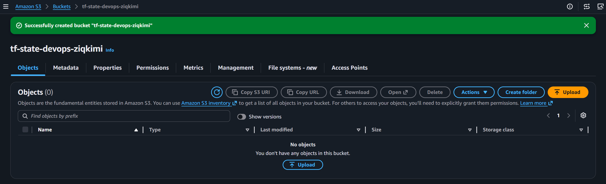

### 2. Create DynamoDB Table for State Locking

```bash
# Table name: terraform-state-lock
# Partition key: LockID (String)
# Capacity mode: On-demand
```

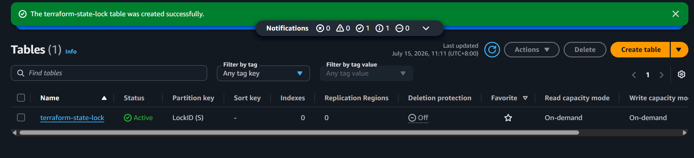

### 3. Create IAM User for GitHub Actions

```
Username: github-actions-terraform
Policy: GitHubActionsTerraformPolicy
```

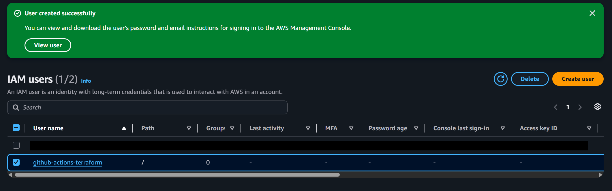
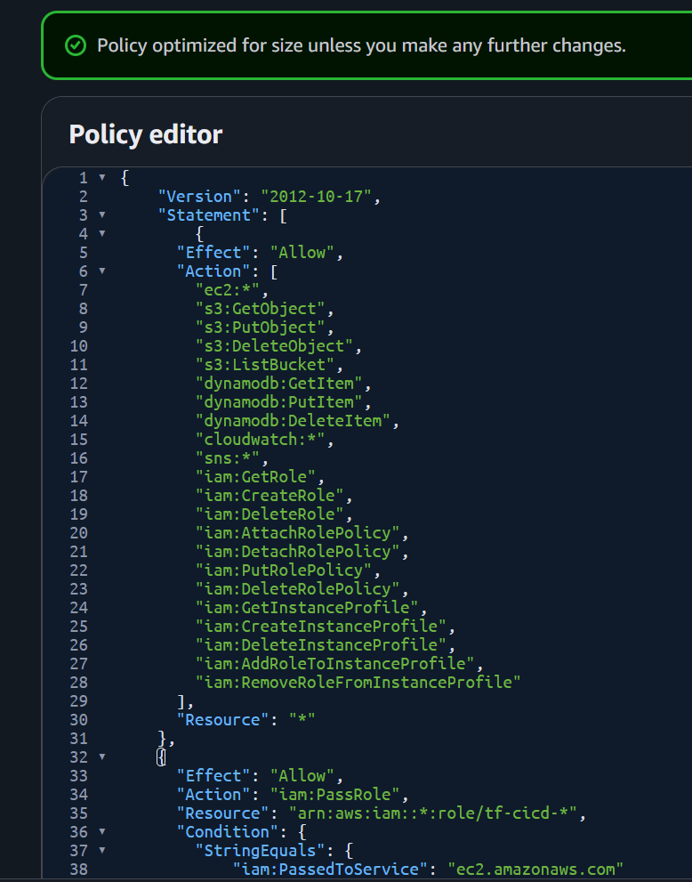
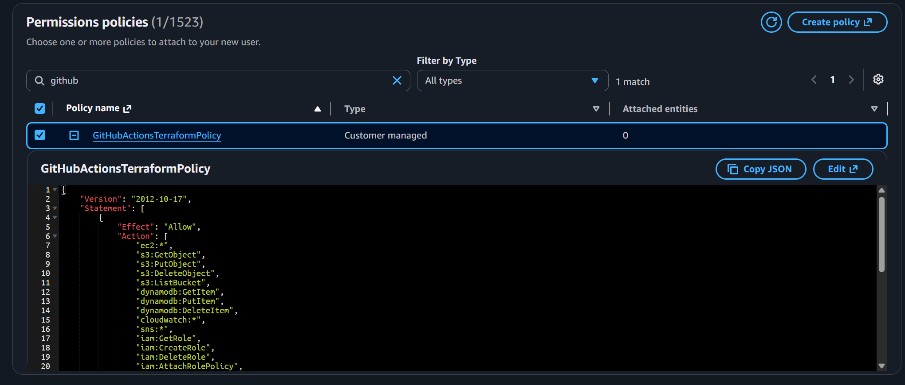

### 4. Add GitHub Secrets

Go to **Settings → Secrets and variables → Actions**:

| Secret Name | Description |
|-------------|-------------|
| `AWS_ACCESS_KEY_ID` | IAM user access key |
| `AWS_SECRET_ACCESS_KEY` | IAM user secret key |
| `ALERT_EMAIL` | Email for CloudWatch alerts |
| `SSH_PUBLIC_KEY` | Your public SSH key for EC2 access |

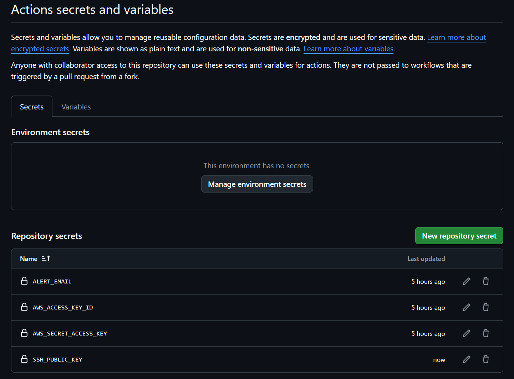

### 5. Configure Production Environment

Go to **Settings → Environments → New Environment**:

```
Name: production
Required reviewers: Add yourself
Wait timer: 0 minutes
```

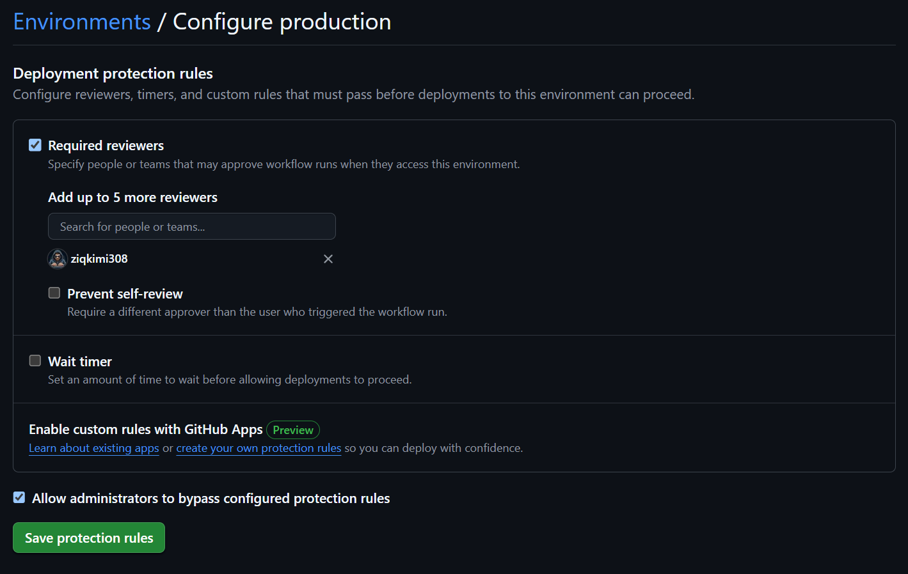

---

## 🚦 Pipeline Stages

| Stage | Trigger | Duration | Action |
|-------|---------|----------|--------|
| **Validate** | Every push/PR | ~16s | `terraform fmt` + `terraform validate` |
| **Plan** | Every push/PR | ~22s | `terraform plan` → artifact + PR comment |
| **Apply** | Push to main only | ~1m 3s | Manual approval → `terraform apply` |
| **Destroy** | Manual trigger | ~1m 54s | Manual approval → `terraform destroy` |

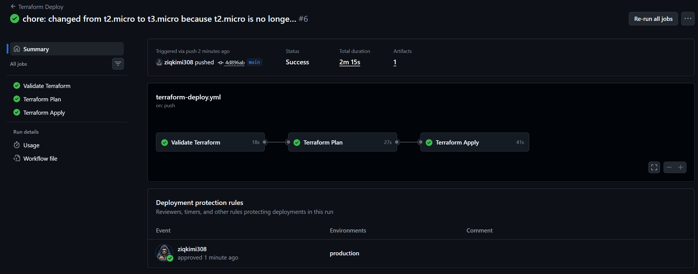
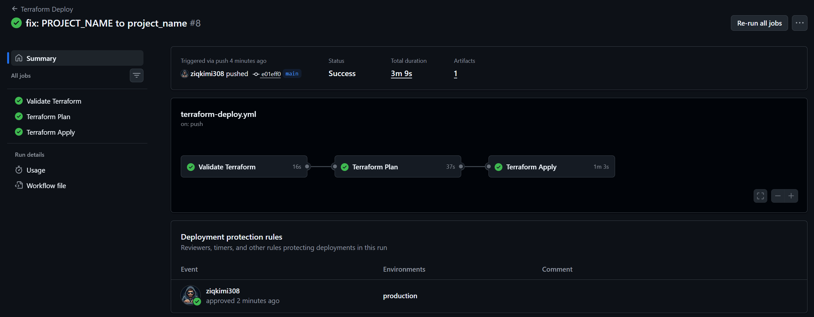

---

## 🔄 Manual Approval Gate

The pipeline pauses at the `apply` stage and waits for approval:

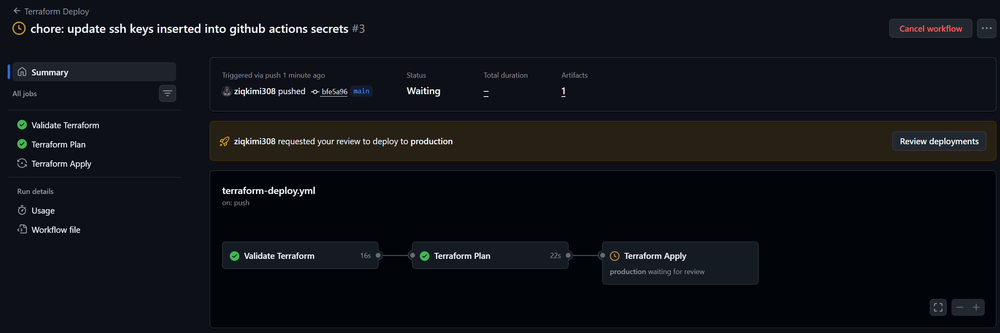
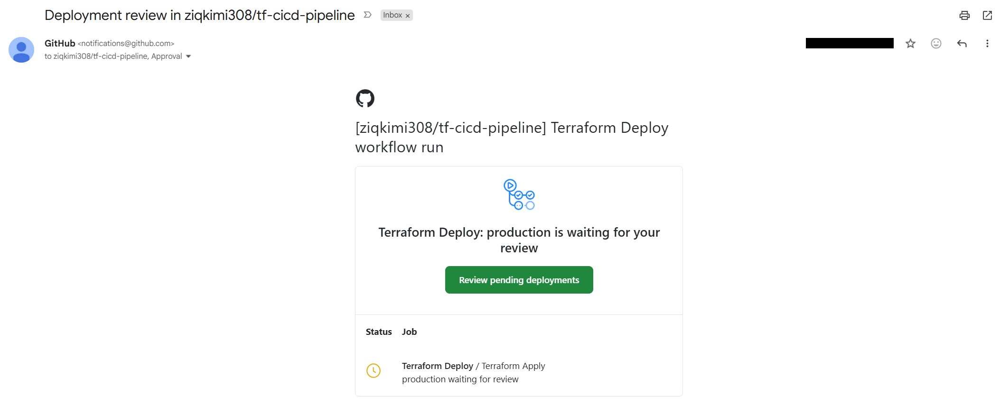
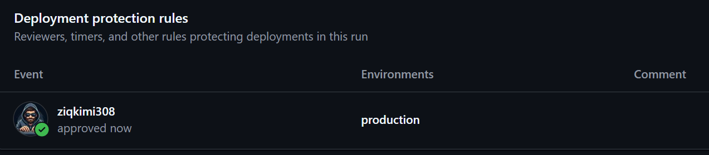

---

## 🌐 Live Website

After deployment, visit the `web_url` output to see:

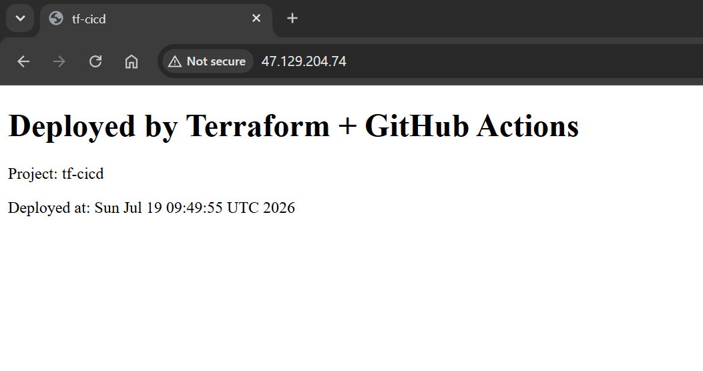
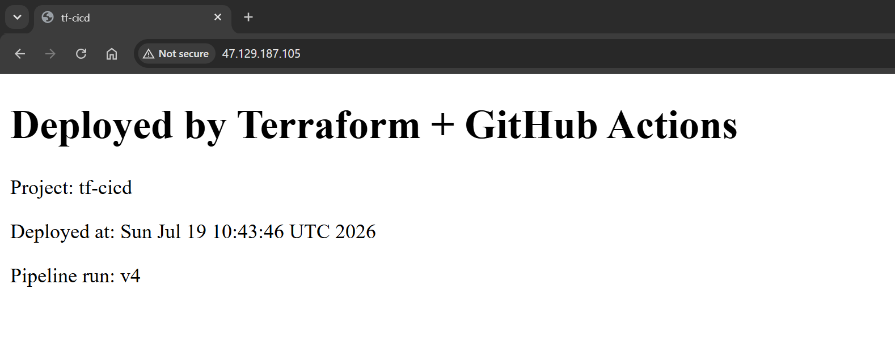
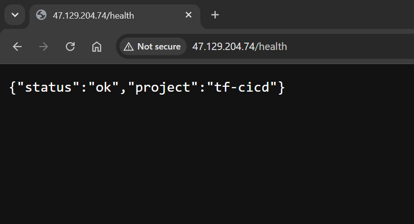

---

## 📧 CloudWatch Alerts

SNS email confirmation after deployment:

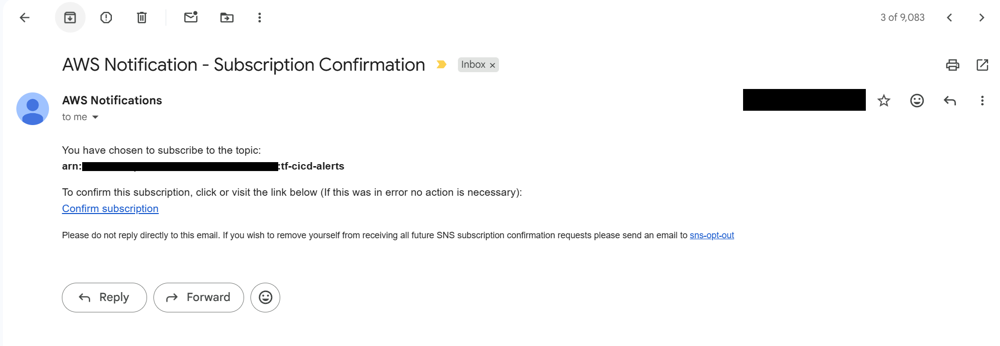

---

## 🗑️ Destroy Workflow

Safely tear down all resources:

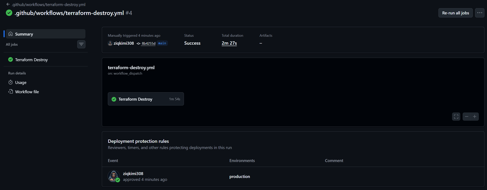

---

## 🧠 Technical Issues & Solutions

This section documents issues encountered during development and their resolutions.

---

### Issue 1: SSH Public Key Injection via GitHub Secrets

**Challenge:** Terraform requires the SSH public key to inject into the EC2 instance, but GitHub runners are ephemeral environments without pre-existing SSH keys.

**Solution:** Stored the public SSH key in GitHub Secrets and injected it at plan time:

```yaml
- name: Terraform Plan
  run: |
    terraform plan \
      -var="ssh_public_key=${{ secrets.SSH_PUBLIC_KEY }}" \
      -out=tfplan
```

**Implementation:** The secret value is passed through the environment and embedded in the `tfplan` artifact, eliminating file system dependencies on the runner.

---

### Issue 2: Template Variable Case Sensitivity (`PROJECT_NAME` vs `project_name`)

**Symptom:**
```
Error: Invalid function argument
vars map does not contain key "PROJECT_NAME", referenced at ./scripts/bootstrap.sh:17,16-28
```

**Root Cause:** Terraform's `templatefile()` function processes template expressions before the script is executed. It matches variable names strictly from the `vars` map and does not recognize Bash variable declarations.

**Solution:** Use the Terraform variable name directly in the template:

```bash
# Before (Incorrect):
PROJECT_NAME="${project_name}"
<title>${PROJECT_NAME}</title>

# After (Correct):
<title>${project_name}</title>
```

**Technical Detail:** The template engine runs at plan time, before any Bash execution. The `vars` map is the authoritative source for substitution.

---

### Issue 3: Instance Type Free-Tier Eligibility (`t2.micro` vs `t3.micro`)

**Symptom:**
```
Error: creating EC2 Instance: InvalidParameterCombination
The specified instance type is not eligible for Free Tier.
```

**Root Cause:** AWS updated Free Tier eligibility. The `t2.micro` instance type was removed from the Free Tier program for new accounts; only `t3.micro` qualifies.

**Verification:**
```bash
aws ec2 describe-instance-types \
  --filters Name=free-tier-eligible,Values=true \
  --query "InstanceTypes[*].[InstanceType]"
```

**Solution:** Changed `instance_type = "t3.micro"` in `terraform.tfvars`.

---

### Issue 4: `user_data` Not Triggering Instance Replacement

**Symptom:** Updates to the EC2 user data script did not execute on the running instance.

**Root Cause:** AWS Provider v5.x performs in-place updates for `user_data` changes by default, not replacement. User data scripts only execute on first boot; modifying them on a running instance has no effect.

**Solution:** Added `user_data_replace_on_change = true` to the EC2 resource:

```hcl
resource "aws_instance" "web" {
  # ... configuration ...
  user_data_replace_on_change = true
}
```

**Sequence:** The flag must be set before the user data content changes. When both conditions are met, Terraform triggers a replace operation (destroy old instance, create new one) instead of an in-place modification.

---

### Issue 5: YAML Schema Validation in GitHub Actions

**Symptom:** IDE validation errors for valid GitHub Actions syntax:
```
Value 'validate' is not valid
Value 'production' is not valid
```

**Root Cause:** Default YAML schemas in IDE linters do not include GitHub Actions specifications.

**Solution:** Added schema reference at the top of workflow files:

```yaml
# yaml-language-server: $schema=https://json.schemastore.org/github-workflow.json
name: Deploy

jobs:
  validate:
    # ...
```

**Note:** GitHub Actions accepts the syntax regardless of local validation. Local linter errors can be safely ignored if the workflow executes successfully.

---

### Issue 6: Cannot Pass Variables to Saved Plan Files

**Symptom:**
```
Error: Can't set variables when applying a saved plan file
The -var and -var-file options cannot be used when applying a saved plan file
```

**Root Cause:** Running `terraform plan -out=tfplan` creates a binary plan file that contains the full desired state, including all variable values. The `terraform apply tfplan` command uses the frozen values; additional `-var` flags are rejected.

**Solution:** Pass all required variables during the plan step only:

```yaml
# Plan job
- name: Terraform Plan
  run: terraform plan -var="key=$value" -out=tfplan

# Apply job
- name: Terraform Apply
  run: terraform apply -auto-approve tfplan
  # No -var flags here
```

**Technical Detail:** Variable values are baked into the binary plan. The apply step only executes the predefined actions.

---

### Issue 7: Orphaned DynamoDB State Lock After Workflow Cancellation

**Symptom:**
```
Error: Error acquiring the state lock
ConditionalCheckFailedException: The conditional request failed
```

**Root Cause:** Cancelling a GitHub Actions workflow terminates the runner mid-execution. Terraform's lock cleanup routine does not run, leaving the lock item in DynamoDB orphaned.

**Solution:** Manually delete the lock from DynamoDB:

```
Terraform lock table: terraform-state-lock
Orphaned item: LockID = path/to/remote/state/file
```

Remove the lock item, then retry the workflow.

**Prevention:** Avoid cancelling workflows. If cancellation is necessary, manually clean up DynamoDB locks before rerunning.

---

### Issue 8: Missing Variables in Destroy Workflow

**Symptom:** Destroy workflow hung waiting for variable input:

```
var.ssh_public_key
  Public SSH key for EC2 access
```

**Root Cause:** The destroy workflow did not pass the `ssh_public_key` variable. Although destruction does not use this value functionally, Terraform's input validation still requires all declared variables to be provided.

**Solution:** Pass all required variables in the destroy command:

```yaml
- name: Terraform Destroy
  run: |
    terraform destroy \
      -var="alert_email=${{ secrets.ALERT_EMAIL }}" \
      -var="ssh_public_key=${{ secrets.SSH_PUBLIC_KEY }}" \
      -auto-approve
```

**Principle:** All variables declared as required must be supplied in every Terraform operation (plan, apply, destroy).

---

### Issue 9: Understanding tfplan vs tfstate vs main.tf

**Conceptual Model:**

| Artifact | Purpose | Storage | Scope |
|----------|---------|---------|-------|
| `main.tf` | Desired state declaration | Git repository | Developer source truth |
| `terraform.tfstate` | Current infrastructure state | S3 backend | Real-time AWS resource state |
| `tfplan` | Action list (diff) | GitHub Artifacts | Temporary execution plan |

**Workflow:**
1. `plan`: Compares `main.tf` (desired) against `tfstate` (current) → generates `tfplan` (actions)
2. `apply`: Executes `tfplan` → modifies AWS resources → updates `tfstate`

---

### Issue 10: DynamoDB's Role in State Locking

**Clarification:** DynamoDB is not a state storage service for this architecture. It functions as a distributed lock service.

| Service | Function |
|---------|----------|
| **S3** | Stores the `terraform.tfstate` file (inventory of deployed resources) |
| **DynamoDB** | Holds a single lock item (`LockID`) to prevent concurrent state modifications |

**Lock Mechanism:**
- When `terraform plan/apply` starts, Terraform creates a lock item in DynamoDB.
- If another operation detects the lock item, it waits or fails (depending on configuration).
- When the operation completes, Terraform deletes the lock item.

---

## 🏆 Key Takeaways

### Architecture & Design Patterns

1. **Remote state is production-critical.** Local state is unsuitable for team environments; S3 + DynamoDB is the standard pattern.

2. **GitHub Actions is the orchestration layer.** It manages job sequencing, artifact passing, and environment access. Terraform is the declarative engine that provisions resources.

3. **Plan files are immutable snapshots.** Once generated with `terraform plan -out=tfplan`, the plan contains all variable values and cannot accept new variables at apply time.

4. **Manual approval gates are essential for production.** GitHub Environments with required reviewers enforce human verification before infrastructure changes.

5. **State locking prevents corruption.** DynamoDB locks ensure only one Terraform operation modifies state at a time, critical in multi-user environments.

### Operational Insights

6. **Free Tier eligibility changes over time.** AWS updates the Free Tier program regularly; always verify current instance type eligibility before deployment.

7. **User data scripts execute once at launch.** Changes to user data require instance replacement, not in-place modification. Use `user_data_replace_on_change = true` to force replacement.

8. **Workflow cancellation creates manual cleanup.** Cancelled jobs leave DynamoDB locks orphaned. Develop a process to detect and clear stale locks.

9. **YAML validation is not authoritative.** Local IDE linters often flag valid GitHub Actions syntax. Trust execution results over static validation.

10. **Variables are required in every operation.** All declared variables must be supplied to `terraform plan`, `apply`, and `destroy`, regardless of whether they are used in destruction logic.

### Skills Demonstrated

| Skill | Implementation |
|-------|----------------|
| **Infrastructure as Code** | VPC, EC2, Security Groups, SNS, CloudWatch in HCL |
| **Remote State Management** | S3 backend with DynamoDB locking |
| **CI/CD Automation** | GitHub Actions multi-stage pipeline with approval gates |
| **Environment Configuration** | GitHub Secrets for credential injection |
| **Monitoring & Alerting** | CloudWatch alarms + SNS email notifications |
| **Module Reusability** | VPC extracted as reusable Terraform module |
| **Security Practices** | IAM least privilege + secrets management |
| **Artifact Passing** | tfplan binary passed between GitHub Actions jobs |
| **Safe Destruction** | Workflow dispatch with manual approval for teardown |

---

## 🏁 Project Completion

This project demonstrates the integration of Infrastructure as Code, CI/CD automation, and cloud platform management. All stages of the pipeline are functional and tested, with remote state management and disaster recovery (destroy) workflows in place.